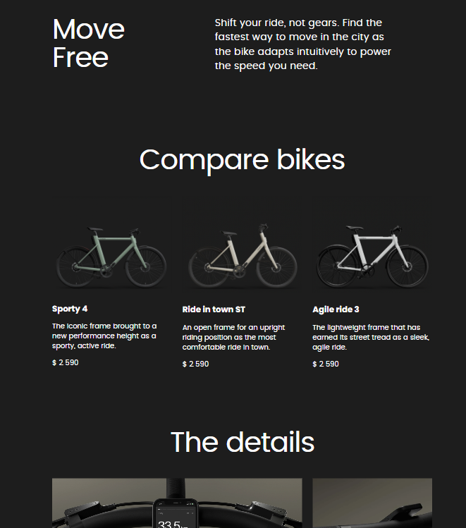

# 🚴‍♂️ Bike Store Landing Page

This is a responsive landing page for an online bike store.
The project was built from scratch to practice modern frontend development.

## 🔧 Technologies

- HTML5
- SCSS (BEM framework)
- JavaScript (ES6+)
- Parcel
- Responsive layout (mobile-first)
- Git/GitHub Pages

## 🔗 Demo

👉 [Go to site](https://andrew1256.github.io/landing_page)

